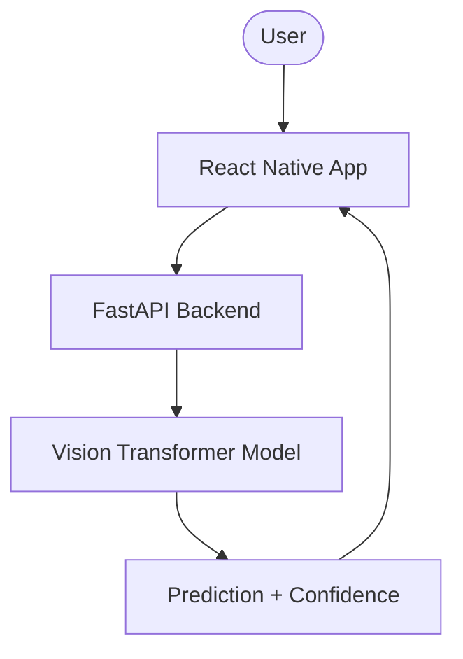

<div align="center">

# 📱 AlzVision AI App

### AI-Powered Alzheimer MRI Analysis Mobile Application

_Modern React Native interface for real-time medical AI inference_

</div>

---

## 📋 Overview

AlzVision AI App is a modern cross-platform mobile application built using React Native and Expo. It provides an intuitive user interface for uploading MRI scans and receiving AI-powered Alzheimer stage predictions in real-time.

The application integrates seamlessly with the AlzVision AI backend API to deliver fast, accurate analysis with a clean Apple-inspired user experience.

Key Goals:

- Simplify AI medical interaction through mobile UI
- Provide instant MRI scan analysis
- Deliver clear and understandable Alzheimer stage results
- Maintain modern, responsive, accessible design

---

## ✨ Features

- 📷 Upload MRI scans from gallery or camera
- 🤖 AI-based Alzheimer stage prediction
- 📊 Confidence score visualization
- ⚡ Real-time backend integration
- 🎨 Apple-inspired modern UI design
- 🌙 Dark mode support
- 🔄 Animated transitions (Reanimated)

---

## 🏗️ Architecture



---

## 📸 Screenshots

<div align="center">


<br/>


</div>

---

## 📁 Project Structure

```
AlzVision-AI/

├── app/            # Navigation & screens
├── components/     # UI components
├── hooks/          # Custom hooks
├── constants/      # App constants
├── assets/         # Images & media
├── scripts/
├── app.json
├── package.json
└── tsconfig.json
```

---

## 🚀 Running the App

Install dependencies:

```bash
npm install
```

Start Expo:

```bash
npx expo start
```

Run on device:

- Scan QR code using Expo Go
- Or run Android/iOS emulator

---

## 🔗 Backend Integration

The app connects to the AlzVision AI backend API:

```
POST /predict
```

Returns:

```json
{
  "prediction": "Moderate_Demented",
  "confidence": 0.81
}
```

---

## 🔬 Technologies Used

- React Native
- Expo
- TypeScript
- React Native Reanimated
- Expo Image Picker
- FastAPI Backend
- Deep Learning AI Model

---

## 🎯 Future Improvements

- On-device AI inference
- Real-time camera scanning
- Patient history tracking
- Medical-grade UI enhancements
- Cloud storage integration

---

## 👨‍💻 Author

Aayush Kumar

---

## ⭐ License

Educational and research purposes.

